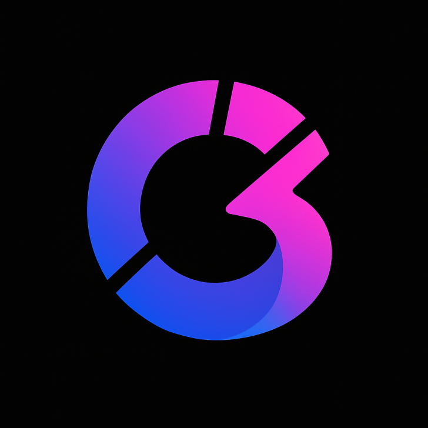

# LetsCommit Core



A decentralized event management protocol that uses commitment-based participation to ensure attendee accountability. Participants stake tokens when enrolling in events, which are progressively unlocked as they attend sessions. This incentivizes attendance while providing organizers with predictable revenue streams.

## Deployments

### Selfhosted Chain

| Contract Name |  Contract Address |
| --- | --- |
| mIDRX | 0x5FbDB2315678afecb367f032d93F642f64180aa3 |
| LetsCommit | 0xe7f1725E7734CE288F8367e1Bb143E90bb3F0512 | 

Protocol Admin: 0xf39Fd6e51aad88F6F4ce6aB8827279cffFb92266

### Monad Testnet Chain

| Contract Name |  Contract Address |
| --- | --- |
| mIDRX | [0xaF82cB6085A05A609F86003B2EC12825a21037A8](https://testnet.monadexplorer.com/address/0xaF82cB6085A05A609F86003B2EC12825a21037A8) |
| LetsCommit | [0xB5D5D1575F8Db2532034b24DB1f288fC937E2120](https://testnet.monadexplorer.com/address/0xB5D5D1575F8Db2532034b24DB1f288fC937E2120) | 
| LetsCommit (Dev) | [0xe56E3d0d93eb297998D9eF298533E4e991c8755c](https://testnet.monadexplorer.com/address/0xe56E3d0d93eb297998D9eF298533E4e991c8755c) | 

Protocol Admin: 0xad382a836ACEc5Dd0D149c099D04aA7B49b64cA6

---

## Architecture

LetsCommit is built on a dual-contract architecture:

- **LetsCommit.sol**: Main protocol contract that manages events, sessions, and participant commitments
- **mIDRX.sol**: Mock Indonesian Rupiah token used for payments and commitments

### Key User Actions

**For Event Organizers:**
- `createEvent`: Create new events with pricing and commitment requirements
- `setSessionCode`: Set attendance codes for each session
- `claimFirstPortion`: Claim immediate portion of event revenue
- `claimUnattendedFees`: Claim fees from participants who missed sessions

**For Participants:**
- `enrollEvent`: Enroll in events by paying price + commitment fee
- `attendSession`: Attend sessions using provided codes to unlock commitment stakes

### Core Mechanisms

1. **Commitment-based Participation**: Participants stake additional tokens beyond the event price, which are progressively unlocked through attendance
2. **Session Management**: Events can have up to 12 sessions with individual attendance tracking. Protocol can define the maximum number of sessions.
3. **Revenue Distribution**: Organizers receive immediate and vested payouts, with unattended fees distributed between organizers and protocol
4. **Progressive Unlocking**: Commitment fees are unlocked proportionally as participants attend sessions

---

## Repository Structure

```
src/
├── LetsCommit.sol           # Main protocol contract
├── mIDRX.sol               # Mock Indonesian Rupiah token
└── interfaces/
    ├── IEventIndexer.sol    # Event logging interface
    └── ILetsCommit.sol      # LetsCommit interface
script/
├── DeployLetsCommit.s.sol         # Deployment scripts
├── DeployLetsCommitAndmIDRX.s.sol
├── LetsCommitCreateEvent.s.sol    # Event creation scripts
├── LetsCommitEnrollEvent.s.sol    # Enrollment scripts
├── LetsCommitAttendSession.s.sol  # Attendance scripts
└── ...
test/
├── LetsCommit.*.t.sol      # Comprehensive test suite
├── mIDRX.t.sol            # Token tests
└── ...
```

---

## Local Deployment and Usage

### Prerequisites

Ensure you have [Foundry](https://getfoundry.sh/) installed:

```sh
curl -L https://foundry.paradigm.xyz | bash
foundryup
```

### Installation

Clone and install dependencies:

```sh
git clone https://github.com/your-org/letscommit-contracts
cd letscommit-contracts
forge install
```

### Testing

Run the complete test suite:

```sh
forge test
```

### Deployment

Deploy to local anvil chain:

```sh
# Start local node
anvil

# Deploy contracts
forge script script/DeployLetsCommitAndmIDRX.s.sol --rpc-url http://localhost:8545 --account <account_name> --broadcast
```

### Example Integration

```solidity
import {LetsCommit} from 'letscommit-contracts/src/LetsCommit.sol';
import {mIDRX} from 'letscommit-contracts/src/mIDRX.sol';

contract MyEventApp {
    LetsCommit letsCommit;
    mIDRX token;

    function createMyEvent() external {
        // Create event with 100 mIDRX price, 50 mIDRX commitment, 3 sessions
        letsCommit.createEvent(
            100e2,  // price amount (100 mIDRX)
            50e2,   // commitment amount (50 mIDRX)
            3,      // total sessions
            50,     // max participants
            block.timestamp + 1 days,  // start sale date
            block.timestamp + 7 days,  // end sale date
            "Event Title",
            "Event Description",
            "Event Location",
            "https://image.url",
            ["tag1", "tag2", "tag3", "tag4", "tag5"],
            [
                block.timestamp + 8 days,   // session 1 start
                block.timestamp + 8 days + 2 hours,  // session 1 end
                block.timestamp + 15 days,  // session 2 start
                block.timestamp + 15 days + 2 hours, // session 2 end
                block.timestamp + 22 days,  // session 3 start
                block.timestamp + 22 days + 2 hours  // session 3 end
            ]
        );
    }
}
```

---

## License

LetsCommit is licensed under UNLICENSED, see [LICENSE](./LICENSE).
